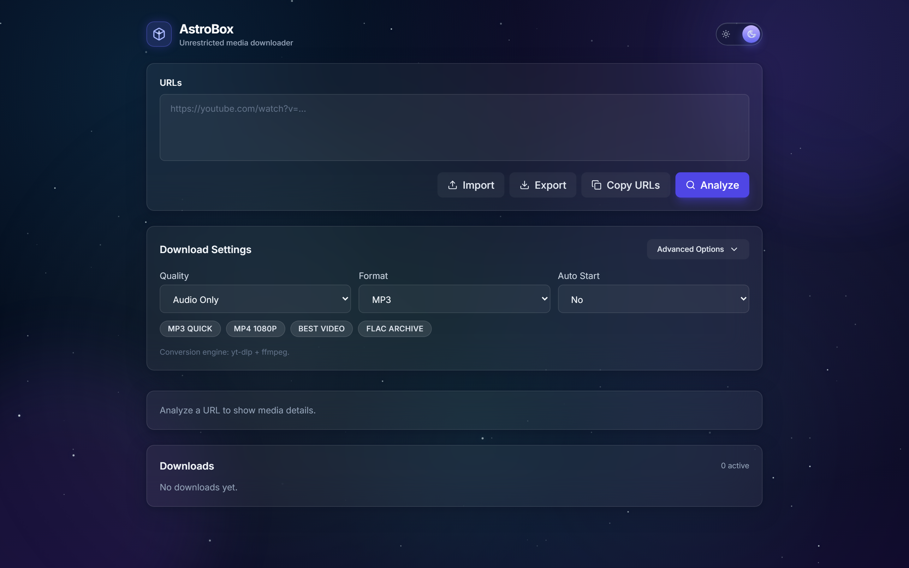
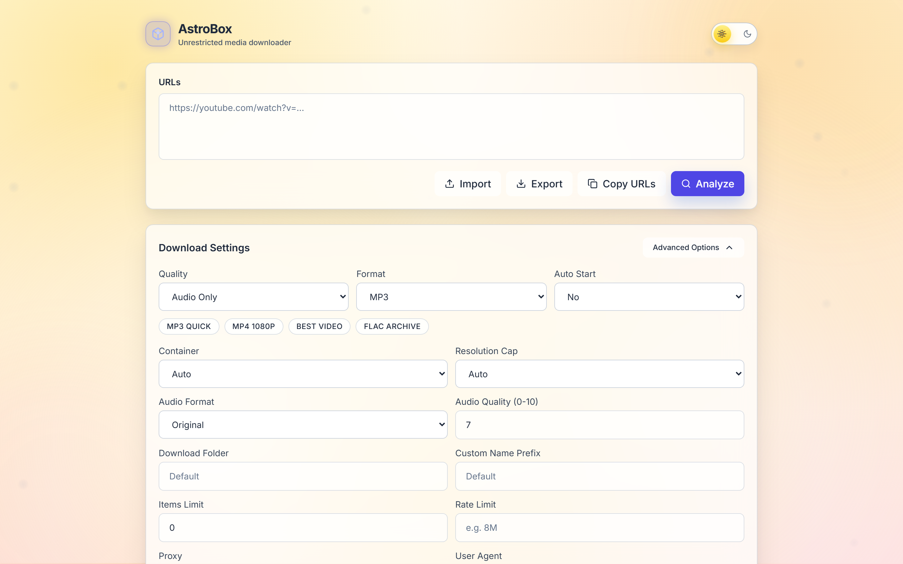

<div align="center">
  
  <br>
  <h1>AstroBox</h1>
  <h3>The Ultimate, Unrestricted Media Orchestration Engine</h3>
</div>

<p align="center">
  Break free from ad-riddled, unreliable web downloaders. AstroBox gives you absolute digital sovereignty over your media. Powered by a robust Node.js backend utilizing <code>yt-dlp</code> and <code>ffmpeg</code>, AstroBox guarantees pristine quality media extraction—wrapped in an immersive, dynamically shifting Glassmorphism interface. 
</p>

## Why AstroBox?
Whether you are a data hoarder archiving history, a video editor needing lossless source files, or a home lab enthusiast curating a Plex library, AstroBox provides an unparalleled self-hosted experience. 

- 🌌 **Immersive Dual-Theme Design**: Switch effortlessly between a deep 100-star animated Galaxy dark mode and a warm, drifting Sunrise light mode. 
- 🚀 **Universal Compatibility**: Effortlessly grab content from **YouTube, Twitch, Twitter/X, Reddit, TikTok, SoundCloud, Instagram, Vimeo, Facebook, BiliBili**, and 1,000+ other endpoints.
- ⚙️ **Audiophile & Cinephile Control**: Enforce 4K resolution targeting, prioritize 60FPS, extract FLAC/ALAC audio, and seamlessly handle HDR formats.
- 🎬 **Automated Post-Processing**: Let AstroBox do the heavy lifting—automatic SponsorBlock removal, precision chapter splitting, and embedded metadata tagging.
- 🛡️ **Hardened Self-Hosting**: Built-in Server-Side Request Forgery (SSRF) protection and configurable API-token security keeps your server locked down.
- 🗂️ **Workflow Profiles**: Save reusable configurations (e.g., "MP3 Quick", "FLAC Archive", "Best Video") to initiate downloads with a single click.

## Application Previews
*(Images located in `docs/images/`)*

### Responsive Dashboard


### Advanced Configuration Panel


## Tech Stack
- **Backend**: Node.js 18, Express.js, Zod
- **Frontend**: React 18, TypeScript, Tailwind CSS, Zustand
- **Database**: Ephemeral Local JSON (`history.json`)
- **Infrastructure**: Native Linux (systemd) or Docker (Alpine Linux)

---

## Installation Methods

### Method 1 — Direct VPS Install (Debian / Ubuntu)

For dedicated servers or bare metal usage. This script completely automates the installation of Node.js 18, Python, FFmpeg, and yt-dlp, pulling the codebase and configuring a resilient `systemd` service for you.

Run this single command as root (or a user with sudo privileges):

```bash
curl -sSL https://raw.githubusercontent.com/SP-J123/AstroBox/master/Final/install.sh | sudo bash
```

**Post-Install Configuration**:
- Edit environment limits: `sudo nano /opt/astrobox/Final/.env`
- Restart the service: `sudo systemctl restart astrobox`
- View live logs: `sudo journalctl -fu astrobox`

### Method 2 — Docker Install

The recommended deployment strategy for scalability and dependency isolation.

```bash
# 1. Clone the repository
git clone https://github.com/SP-J123/AstroBox.git
cd AstroBox/Final

# 2. Create your environment config
cp .env.example .env

# 3. Add an API Token to .env for security (Optional but highly recommended)
# WRITE_API_TOKEN=your_secure_random_string

# 4. Build and launch
docker-compose up -d --build
```
    
**Post-Install Configuration**:
- **Ports**: Exposes port `3536` by default.
- **Volumes**: Media is saved to `./downloads`, and DB/Options are stored in `./config`.
- **Stopping**: `docker-compose down`

---

## Environment Variables

Configure AstroBox entirely through the `.env` file. Do not run in production without configuring limits if exposed to the internet.

| Variable | Description | Required |
| --- | --- | --- |
| `PORT` | Node.js Express Server Port | No (Default: 3536) |
| `WRITE_API_TOKEN` | Token required for download/delete requests | No (Strongly Recommended) |
| `MAX_ACTIVE_UNITS` | Concurrency limit (Audio=1, HD=2, 4K=4) | No (Default: 8) |
| `DOWNLOAD_DIR` | Host volume storage for downloaded files | No |
| `CONFIG_DIR` | Host volume storage for DB/History | No |
| `COOKIES_FILE` | Path to a Netscape cookies.txt | No |

---

## Folder Structure (Production)

```text
Final/
├── docs/                 # Extended Deployment and Troubleshooting manuals
├── config/               # Stored UI profiles and job history
├── scripts/              # Internal application scripts 
├── src/                  # Application Source Code
├── docker-compose.yml    # Docker orchestration
├── Dockerfile            # Lightweight Alpine Multi-stage image
├── install.sh            # One-click Ubuntu/Debian deployment
├── package.json          # Node dependencies
└── .env.example          # Environment defaults
```

---

## Production Notes

- **Security Requirements**: DO NOT expose port `3536` directly to the open internet without generating a `WRITE_API_TOKEN` in the `.env` file first.
- **Reverse Proxy**: AstroBox should be deployed behind an Nginx or Caddy proxy. Note that proxy configurations MUST disable buffering (`proxy_buffering off`) to support Real-Time Progress Bars (Server-Sent Events).
- **SSL Certificates**: Handle SSL termination at your proxy layer using Certbot/Let's Encrypt. 

---

## License

ISC License. See `package.json` for details. Use responsibly and adhere to local copyright classifications when downloading media.
